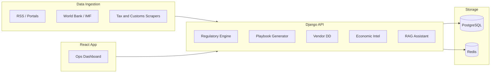

# EastBridge Ops Intelligence

Independent developer project: an AI-powered market-entry, compliance, trade, and vendor-risk platform for European companies operating in East Africa.

> I am an independent developer who built this app to help EU companies understand, verify, and operate in Uganda, Kenya, Tanzania, Rwanda, and the EAC region using continuously updated legal, trade, economic, and operational intelligence.

## Tier 1 pillars

| Module | Purpose |
|--------|---------|
| **Regulatory Change Engine** | Monitors tax, customs, investment, EAC trade, data protection, and labor updates with source URLs, impact summaries, and required actions |
| **Market Entry Playbooks** | Generates registration, tax, import, permit, and compliance checklists by industry and country |
| **Vendor Due Diligence** | Local supplier profiles with verification, risk scores, contract/payment history, red flags |
| **Economic Intelligence** | World Bank, central bank, FX, and trade indicators with country risk snapshots |
| **Proof-Based AI Assistant** | Answers only with cited evidence — no unsupported claims |

## Stack

- **Backend:** Django 5 + Django REST Framework
- **Frontend:** React 19 + TypeScript (Vite)
- **Database:** PostgreSQL (SQLite for local dev without Docker)
- **Workers:** Celery + Redis
- **Deploy:** Docker Compose (Railway-ready)

## Quick start

### Downloaded the ZIP (no git clone)?

See **[DOWNLOAD.md](DOWNLOAD.md)** — lists every folder in the zip (`frontend/` + `backend/` + deploy files) and how to run locally.

### One command (recommended)

Runs API and UI in **this terminal only** — no extra PowerShell windows.

```powershell
npm run dev
# or: .\start.ps1
```

Press `Ctrl+C` to stop both servers.

### Production / client domain

See **[DEPLOY.md](DEPLOY.md)** for Docker deployment on your domain (single nginx entry point, gunicorn, no dev popups).

```powershell
npm run prod:up
```

### First-time setup

```bash
cp .env.example .env
python -m venv .venv
.venv\Scripts\activate          # Windows
pip install -r backend/requirements.txt
cd backend
python manage.py migrate
python manage.py seed_data
python manage.py seed_demo_org
python manage.py embed_evidence --force
cd ../frontend
npm install
cd ..
npm run dev
```

### Manual (two terminals)

**Backend**

```bash
cd backend
../.venv/Scripts/python manage.py runserver 8888   # use 8888 if :8000 is occupied
```

**Frontend**

```bash
cd frontend
npm run dev
```

Open [http://localhost:5173](http://localhost:5173).

### 3. Docker (PostgreSQL + Redis + workers + UI)

```bash
cp .env.example .env
docker compose up --build
```

- API: [http://localhost:8000](http://localhost:8000)
- UI (nginx): [http://localhost:8080](http://localhost:8080)

Production-style (gunicorn, UI on port 80):

```bash
docker compose -f docker-compose.yml -f docker-compose.prod.yml up --build
```

## API endpoints

| Path | Description |
|------|-------------|
| `GET /api/v1/countries/` | EAC target countries |
| `GET /api/v1/health/` | API and database health |
| `GET /api/v1/regulatory/changes/` | Regulatory change feed |
| `POST /api/v1/playbooks/generate/` | Generate market entry playbook |
| `GET /api/v1/vendors/` | Vendor due diligence records |
| `GET /api/v1/intelligence/indicators/` | Economic indicators |
| `POST /api/v1/assistant/queries/ask/` | Evidence-backed Q&A |

## Architecture



## Roadmap

### Phase 2

- **Ingestion workers** — RSS, HTML list scrapers, World Bank API sync
- **Evidence indexing** — All ingested content indexed for assistant retrieval
- **Playbook engine** — Industry/country rule templates enriched with evidence
- **Scored retrieval** — Assistant uses ranked evidence search with citations
- **Change alerts** — Email + webhook on new `RegulatoryChange` records
- **Celery Beat** — Scheduled ingestion every 6h (regulatory) and daily (economic)

Run ingestion manually:

```bash
cd backend
python manage.py ingest --target all
python manage.py ingest --target economic
python manage.py ingest --target regulatory
```

### Phase 3

- **Semantic RAG** — hybrid keyword + cosine retrieval; pgvector on PostgreSQL
- **EAC TIP integration** — trade procedures with `--offline` fallback
- **Auth & multi-tenant** — JWT, organizations, scoped data

### Phase 4

- **Vendor CRUD** — `POST/PATCH/DELETE /api/v1/vendors/` (org-scoped)
- **Document upload** — `POST /api/v1/vendors/{id}/upload_document/`
- **Change alerts** — `GET/POST/DELETE /api/v1/regulatory/alerts/`
- **Demo data** — `python manage.py seed_demo_org` (vendors + alert subscription)
- **Production embeddings** — OpenAI, fastembed (local), hash fallback

### Phase 5

- **Vendor document UI** — upload PDFs and certificates per supplier on `/vendors`
- **Playbook auth** — generate and list playbooks require sign-in (org-scoped)
- **Saved playbooks** — previously generated playbooks load from your organization

### Phase 6

- **Ops dashboard** — trade procedure count, embedding provider, ingestion sync times on Overview
- **Country risk snapshots** — `/intelligence` shows World Bank–derived risk scores per EAC country
- **Vendor edit/delete** — inline edit verification status, risk score; delete suppliers
- **Regulatory filters** — filter changes by country and category
- **Assistant transparency** — shows retrieval method (`hybrid+openai`, `pgvector+fastembed`, etc.)

### Phase 7

- **Playbook progress** — check off steps; `PATCH /api/v1/playbooks/steps/{id}/`
- **Assistant history** — org-scoped recent queries when signed in
- **Trade filters** — filter procedures by country, activity type, and search
- **Health check** — `GET /api/v1/health/` for deploy monitoring

### Phase 8

- **LLM-grounded answers** — OpenAI synthesizes answers from retrieved evidence only (`ANSWER_PROVIDER=auto`)
- **Vendor contracts & payments** — `POST .../add_contract/`, `POST .../add_payment/` + UI on `/vendors`
- **Ops health indicator** — API/database status on Overview dashboard
- **Docker hardening** — Postgres/Redis/backend healthchecks; `DATABASE_URL` set for Compose services

### Phase 9

- **Production Docker** — frontend nginx image (`:8080`), gunicorn via `docker-compose.prod.yml`, persistent `media` volume
- **Playbook export** — download checklist as Markdown from `/playbooks`
- **Regulatory search** — full-text search on titles and impact summaries
- **CI** — GitHub Actions backend `manage.py check` + frontend build

### Phase 10

- **Auth proxy fix** — login uses same `/api/v1` path as the Vite dev proxy
- **Org switcher** — sidebar dropdown when a user belongs to multiple organizations
- **Intelligence filters** — country filter on risk snapshots and indicators
- **Regulatory risk filter** — filter by low / medium / high / critical
- **Assistant quick-picks** — one-click EAC country example questions
- **Vendor summary** — supplier count, average risk, flagged count on `/vendors`
- **Dev script** — `scripts/dev.ps1` starts backend on `:8888` + frontend on `:5173`

### Phase 11

- **Multi-org demo** — `seed_demo_org` creates Helio Solar GmbH (UG) and NordWind Energy AG (KE) for the org switcher
- **Assistant export** — download or copy grounded answers as Markdown with citations
- **Alert pause/resume** — toggle subscriptions without deleting them
- **Regulatory → alerts** — subscribe link prefills country/category from current filters
- **Org dashboard** — Overview shows vendor, alert, and query counts for the active organization
- **Assistant fix** — anonymous users can ask questions; citation scores no longer overflow SQLite

### Phase 12 (current)

- **Assistant deep links** — `/assistant?q=...&country=UG` prefills questions from Trade and Regulatory pages
- **Trade export** — download procedure checklists as Markdown
- **Cross-module actions** — “Ask assistant” on regulatory changes and trade procedures
- **Playbook delete** — `DELETE /api/v1/playbooks/{id}/` + UI remove button
- **Overview feed** — latest five regulatory changes on the dashboard

```powershell
# Re-seed demo orgs (safe to re-run)
python manage.py seed_demo_org
```

```powershell
# Windows local dev (when :8000 is taken)
.\scripts\dev.ps1
```

```bash
# Local dev (SQLite)
python manage.py runserver

# Docker dev stack (API :8000, UI :8080)
docker compose up --build

# Production-style (gunicorn + UI on :80)
docker compose -f docker-compose.yml -f docker-compose.prod.yml up --build
```

**Railway (Gilliom):** see [DEPLOY-RAILWAY.md](DEPLOY-RAILWAY.md) — deploy via [Deployment-Stripe-center](https://github.com/dallas8000-ops/Deployment-Stripe-center) or manual Railway; production URL `https://eastbridge.gilliomfrontlinedigital.com`.

After first Docker start:

```bash
docker compose exec backend python manage.py migrate
docker compose exec backend python manage.py seed_data
docker compose exec backend python manage.py seed_demo_org
docker compose exec backend python manage.py ingest --target economic
docker compose exec backend python manage.py sync_trade_procedures --offline
docker compose exec backend python manage.py embed_evidence
```

Assistant answer configuration (`.env`):

| Variable | Default | Description |
|----------|---------|-------------|
| `ANSWER_PROVIDER` | `auto` | `openai`, `template`, or `auto` (OpenAI when key set) |
| `OPENAI_CHAT_MODEL` | `gpt-4o-mini` | Chat model for grounded answers |

Embedding configuration (`.env`):

| Variable | Default | Description |
|----------|---------|-------------|
| `EMBEDDING_PROVIDER` | `openai` | `fastembed`, `openai`, `hash`, or `auto` |
| `OPENAI_API_KEY` | `sk-...` | Required when `EMBEDDING_PROVIDER=openai` |
| `OPENAI_EMBEDDING_MODEL` | `text-embedding-3-small` | OpenAI model (uses `dimensions=384`) |
| `EMBEDDING_MODEL` | `BAAI/bge-small-en-v1.5` | fastembed model when provider is `fastembed` |
| `EMBEDDING_DIM` | `384` | Must match pgvector column |

## Positioning

Built by an independent developer. Available for remote contractor engagements with U.S., European, and international companies.
