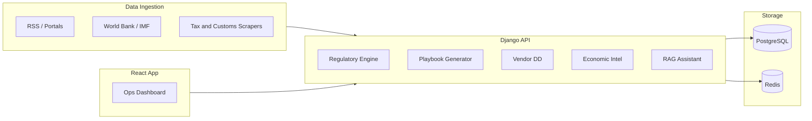

# EastBridge Ops Intelligence

Independent developer project: an AI-powered market-entry, compliance, trade, and vendor-risk platform for European companies operating in East Africa.

> I am an independent developer who built this app to help EU companies understand, verify, and operate in Uganda, Kenya, Tanzania, Rwanda, and the EAC region using continuously updated legal, trade, economic, and operational intelligence.

> **At a glance**
> - **What:** market-entry, compliance, trade and vendor-risk intelligence for EU companies operating in Uganda, Kenya, Tanzania, Rwanda and the wider EAC.
> - **Stack:** Django 5.2 + DRF · React 19 + TypeScript (Vite) · PostgreSQL + pgvector · Celery + Redis · Docker · Railway
> - **Engineering:** RAG assistant that answers only from cited evidence · scheduled ingestion workers · multi-tenant org scoping · 120+ backend tests in CI with coverage
> - **Live:** https://eastbridge.gilliomfrontlinedigital.com

## Tier 1 pillars

| Module | Purpose |
|--------|---------|
| **Regulatory Change Engine** | Monitors tax, customs, investment, EAC trade, data protection, and labor updates with source URLs, impact summaries, and required actions |
| **Market Entry Playbooks** | Generates registration, tax, import, permit, and compliance checklists by industry and country |
| **Vendor Due Diligence** | Local supplier profiles with verification, risk scores, contract/payment history, red flags |
| **Economic Intelligence** | World Bank, central bank, FX, and trade indicators with country risk snapshots |
| **Proof-Based AI Assistant** | Answers only with cited evidence — no unsupported claims |

## Stack

- **Backend:** Django 5 + Django REST Framework
- **Frontend:** React 19 + TypeScript (Vite)
- **Database:** PostgreSQL (SQLite for local dev without Docker)
- **Workers:** Celery + Redis
- **Deploy:** Docker Compose (Railway-ready)

## Quick start

### Downloaded the ZIP (no git clone)?

See **[DOWNLOAD.md](DOWNLOAD.md)** — lists every folder in the zip (`frontend/` + `backend/` + deploy files) and how to run locally.

### Sharing the repo (GitHub zip includes app data)

Committed JSON under **`backend/fixtures/`** is the app image in every zip download. Before you push:

```powershell
npm run export:fixtures    # refresh fixtures from the canonical dataset
npm run hooks:install      # optional: auto-refresh fixtures before each push
```

CI verifies fixtures stay in sync on every push to `main`.

### One command (recommended)

Runs API and UI in **this terminal only** — no extra PowerShell windows.

```powershell
npm run dev
# or: .\start.ps1
```

Press `Ctrl+C` to stop both servers.

### Production / client domain

See **[DEPLOY.md](DEPLOY.md)** for Docker deployment on your domain (single nginx entry point, gunicorn, no dev popups).

```powershell
npm run prod:up
```

### First-time setup

```bash
cp .env.example .env
python -m venv .venv
.venv\Scripts\activate          # Windows
pip install -r backend/requirements.txt
cd backend
python manage.py migrate
python manage.py load_initial_data
python manage.py verify_data
cd ../frontend
npm install
cd ..
npm run dev
```

### Manual (two terminals)

**Backend**

```bash
cd backend
../.venv/Scripts/python manage.py runserver 8888   # use 8888 if :8000 is occupied
```

**Frontend**

```bash
cd frontend
npm run dev
```

Open [http://localhost:5173](http://localhost:5173).

### 3. Docker (PostgreSQL + Redis + workers + UI)

```bash
cp .env.example .env
docker compose up --build
```

- API: [http://localhost:8000](http://localhost:8000)
- UI (nginx): [http://localhost:8080](http://localhost:8080)

Production-style (gunicorn, UI on port 80):

```bash
docker compose -f docker-compose.yml -f docker-compose.prod.yml up --build
```

## API endpoints

| Path | Description |
|------|-------------|
| `GET /api/v1/countries/` | EAC target countries |
| `GET /api/v1/health/` | API and database health |
| `GET /api/v1/regulatory/changes/` | Regulatory change feed |
| `POST /api/v1/playbooks/generate/` | Generate market entry playbook |
| `GET /api/v1/vendors/` | Vendor due diligence records |
| `GET /api/v1/intelligence/indicators/` | Economic indicators |
| `POST /api/v1/assistant/queries/ask/` | Evidence-backed Q&A |

## Architecture


```mermaid
flowchart LR
  subgraph ingestion [Data Ingestion]
    RSS[RSS / Portals]
    APIs[World Bank / IMF]
    Scrapers[Tax and Customs Scrapers]
  end

  subgraph backend [Django API]
    Regulatory[Regulatory Engine]
    Playbooks[Playbook Generator]
    Vendors[Vendor DD]
    Intel[Economic Intel]
    Assistant[RAG Assistant]
  end

  subgraph storage [Storage]
    PG[(PostgreSQL)]
    Redis[(Redis)]
  end

  subgraph frontend [React App]
    Dashboard[Ops Dashboard]
  end

  ingestion --> backend
  backend --> PG
  backend --> Redis
  frontend --> backend
```

## What's built

| Area | Implementation |
|------|----------------|
| **Evidence-grounded assistant** | Hybrid keyword + vector retrieval (pgvector on PostgreSQL); answers are synthesized only from retrieved evidence and returned with citations and relevance scores. Embeddings: OpenAI, local fastembed, or hash fallback. |
| **Ingestion pipeline** | Celery Beat schedules: regulatory sources every 6h, economic indicators daily (World Bank, RSS, tax/customs portals, EAC Trade Information Portal with offline fallback). |
| **Multi-tenant SaaS core** | JWT auth, organizations with an org switcher, org-scoped vendors, playbooks, alerts and query history. |
| **Vendor due diligence** | Supplier CRUD, document upload, contracts and payment history, risk scoring and red flags. |
| **Market-entry playbooks** | Generated per industry and country, with step tracking and Markdown export. |
| **Alerts** | Email and webhook notifications on new regulatory changes, with pause/resume. |
| **Ops** | Health endpoint, Docker Compose dev/prod stacks (gunicorn + nginx), Railway deploy, CI with coverage, strict backend gate and fixture verification. |

Full phase-by-phase history: [CHANGELOG.md](CHANGELOG.md).

## Operations

```powershell
# Re-seed demo orgs (safe to re-run)
python manage.py seed_demo_org
```

```powershell
# Windows local dev (when :8000 is taken)
.\scripts\dev.ps1
```

```bash
# Local dev (SQLite)
python manage.py runserver

# Docker dev stack (API :8000, UI :8080)
docker compose up --build

# Production-style (gunicorn + UI on :80)
docker compose -f docker-compose.yml -f docker-compose.prod.yml up --build
```

**Railway (Gilliom):** see [DEPLOY-RAILWAY.md](DEPLOY-RAILWAY.md) — deploy via [Deployment-Stripe-center](https://github.com/dallas8000-ops/Deployment-Stripe-center) or manual Railway; production URL `https://eastbridge.gilliomfrontlinedigital.com`.

After first Docker start:

```bash
docker compose exec backend python manage.py migrate
docker compose exec backend python manage.py seed_data
docker compose exec backend python manage.py seed_demo_org
docker compose exec backend python manage.py ingest --target economic
docker compose exec backend python manage.py sync_trade_procedures --offline
docker compose exec backend python manage.py embed_evidence
```

Assistant answer configuration (`.env`):

| Variable | Default | Description |
|----------|---------|-------------|
| `ANSWER_PROVIDER` | `auto` | `openai`, `template`, or `auto` (OpenAI when key set) |
| `OPENAI_CHAT_MODEL` | `gpt-4o-mini` | Chat model for grounded answers |

Embedding configuration (`.env`):

| Variable | Default | Description |
|----------|---------|-------------|
| `EMBEDDING_PROVIDER` | `openai` | `fastembed`, `openai`, `hash`, or `auto` |
| `OPENAI_API_KEY` | `sk-...` | Required when `EMBEDDING_PROVIDER=openai` |
| `OPENAI_EMBEDDING_MODEL` | `text-embedding-3-small` | OpenAI model (uses `dimensions=384`) |
| `EMBEDDING_MODEL` | `BAAI/bge-small-en-v1.5` | fastembed model when provider is `fastembed` |
| `EMBEDDING_DIM` | `384` | Must match pgvector column |

## Positioning

Built by an independent developer. Available for remote contractor engagements with U.S., European, and international companies.
